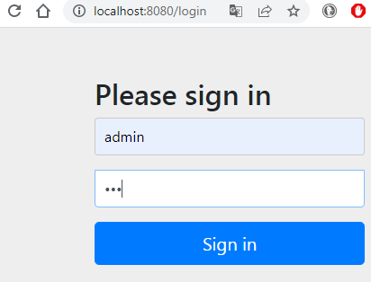
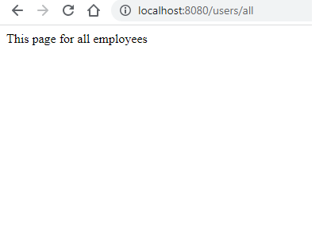

# spring_security_6
простой пример авторизация и аутентификация на основе базы данных в Spring Security 6.

Приложение состоит из базы данных в postgresql с таблицей: users 
с заполнеными в ней полями данных пользователей. 
У каждого из трех пользователей есть определеные права для доступа  
по различным точкам приложения. 
Контролллер с конечными точками, при отклике на них, высылает простое текстовое сообщение 

  
Рисунок 1. Простая форма регистрации "из коробки", для пользователя с username: 'admin'.  

password (для всех пользователей в бд): '123' в закондированом виде (Bcrypt) с помощью https://bcrypt-generator.com/    

контроллер с простыми конечными точками, доступными по различным правам доступа: 
  users/welcome — страница доступна всем без авторизации; 
  users/users — страница для пользователей с правами ROLE_USER в базе данных; 
  users/admins — страница для пользователей с правами ROLE_ADMIN в базе данных; 
  users/all — для всех, но после авторизации. 

  
Рисунок 2. страница с откликом для конечной точки users/all.  

Статья о том как писать код по новому в spring_security_6 https://javatechonline.com/websecurityconfigureradapter-deprecated/